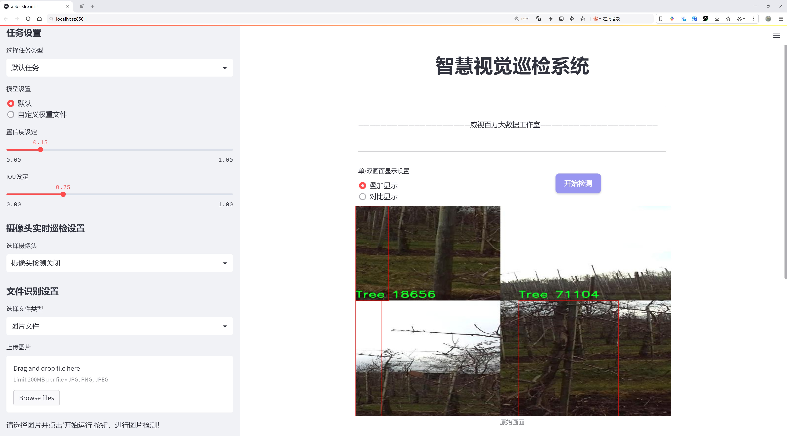
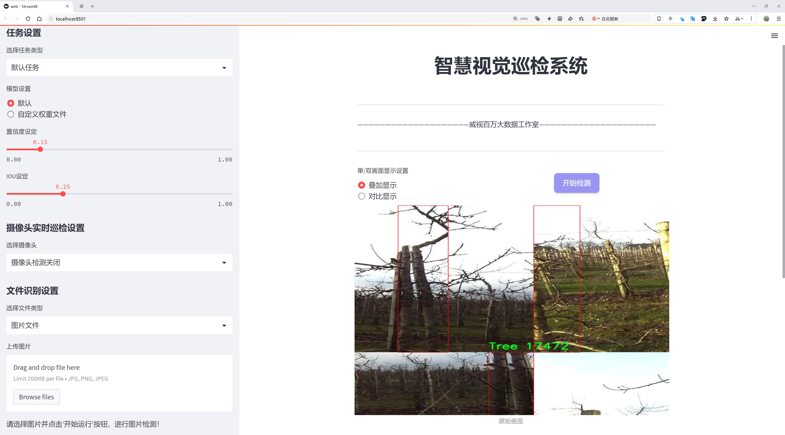
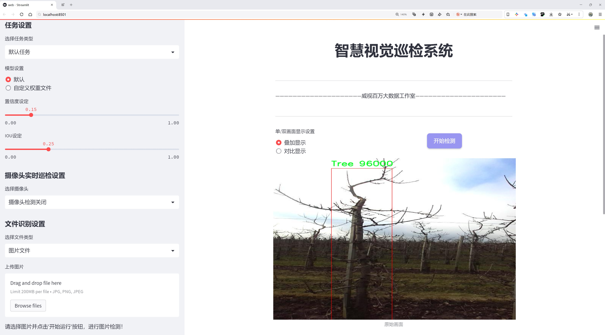
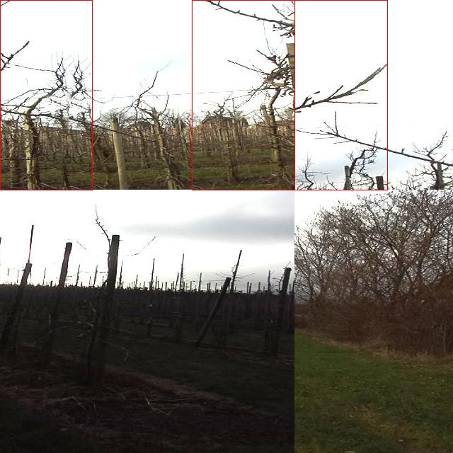
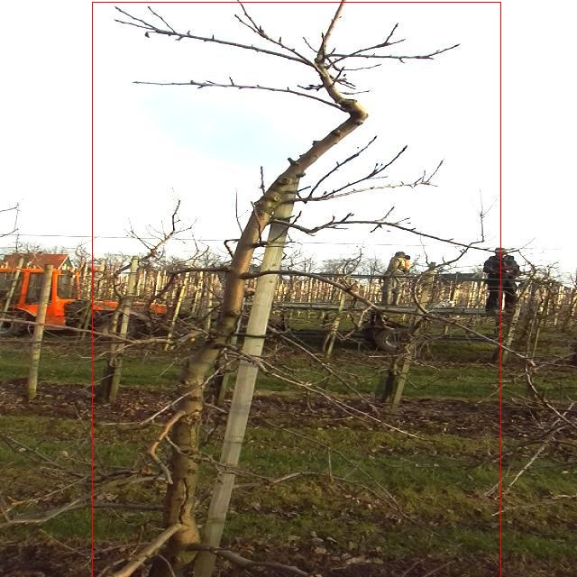
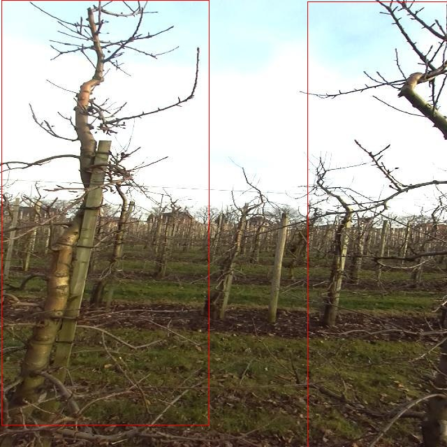
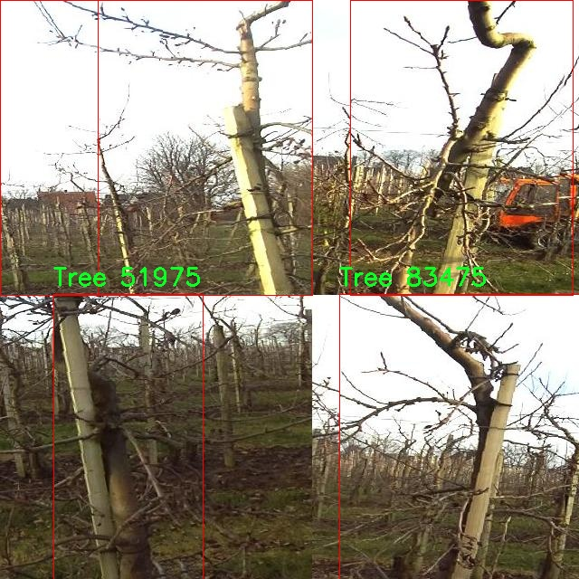
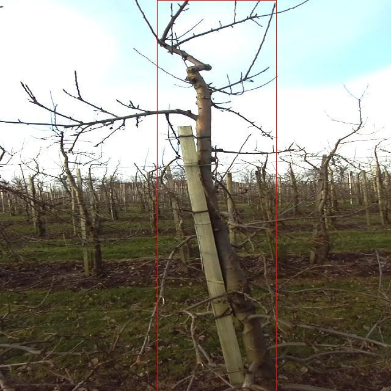

# 树木检测检测系统源码分享
 # [一条龙教学YOLOV8标注好的数据集一键训练_70+全套改进创新点发刊_Web前端展示]

### 1.研究背景与意义

项目参考[AAAI Association for the Advancement of Artificial Intelligence](https://gitee.com/qunmasj/projects)

项目来源[AACV Association for the Advancement of Computer Vision](https://kdocs.cn/l/cszuIiCKVNis)

研究背景与意义

随着全球城市化进程的加速，树木作为生态系统的重要组成部分，其监测与管理显得尤为重要。树木不仅在改善城市环境、提升空气质量、提供栖息地等方面发挥着重要作用，还在应对气候变化、维护生物多样性等方面具有不可替代的价值。然而，传统的树木监测方法往往依赖人工巡查，效率低下且易受主观因素影响，难以满足现代城市管理的需求。因此，基于计算机视觉和深度学习技术的自动化树木检测系统应运而生，成为当前研究的热点之一。

在众多的目标检测算法中，YOLO（You Only Look Once）系列因其高效性和实时性受到广泛关注。YOLOv8作为该系列的最新版本，结合了深度学习的先进技术，具备了更高的检测精度和更快的处理速度。然而，尽管YOLOv8在多种目标检测任务中表现出色，但在特定场景下，如树木检测，仍然存在一些挑战。例如，树木的形态、颜色和背景的多样性使得检测算法在识别树木时可能出现误判或漏检现象。因此，改进YOLOv8以适应树木检测的特殊需求，具有重要的研究意义。

本研究将基于“Samson Tree detection”数据集，进行YOLOv8的改进与优化。该数据集包含9500张树木图像，专注于单一类别“树”，为模型的训练和测试提供了丰富的样本。通过对该数据集的深入分析，我们可以识别出树木在不同环境下的特征，进而调整YOLOv8的网络结构和参数设置，以提高其在树木检测任务中的表现。具体而言，我们将探索数据增强、特征提取和模型集成等技术手段，以增强模型的鲁棒性和适应性。

此外，树木检测系统的研究不仅具有理论价值，还具有广泛的应用前景。通过构建高效的树木检测系统，可以为城市绿化管理、生态监测、环境保护等领域提供有力支持。例如，城市管理者可以利用该系统实时监测城市绿地的树木生长情况，及时发现病虫害或其他影响树木健康的问题，从而采取相应的管理措施。此外，该系统还可以为科研人员提供数据支持，帮助他们进行生态研究和生物多样性评估。

综上所述，基于改进YOLOv8的树木检测系统的研究，不仅填补了当前树木监测技术的空白，也为城市生态管理提供了新的解决方案。通过这一研究，我们期望能够推动树木检测技术的发展，为实现可持续城市发展贡献力量。

### 2.图片演示







##### 注意：由于此博客编辑较早，上面“2.图片演示”和“3.视频演示”展示的系统图片或者视频可能为老版本，新版本在老版本的基础上升级如下：（实际效果以升级的新版本为准）

  （1）适配了YOLOV8的“目标检测”模型和“实例分割”模型，通过加载相应的权重（.pt）文件即可自适应加载模型。

  （2）支持“图片识别”、“视频识别”、“摄像头实时识别”三种识别模式。

  （3）支持“图片识别”、“视频识别”、“摄像头实时识别”三种识别结果保存导出，解决手动导出（容易卡顿出现爆内存）存在的问题，识别完自动保存结果并导出到tempDir中。

  （4）支持Web前端系统中的标题、背景图等自定义修改，后面提供修改教程。

  另外本项目提供训练的数据集和训练教程,暂不提供权重文件（best.pt）,需要您按照教程进行训练后实现图片演示和Web前端界面演示的效果。

### 3.视频演示

[3.1 视频演示](https://www.bilibili.com/video/BV1j4s8ePExi/)

### 4.数据集信息展示

##### 4.1 本项目数据集详细数据（类别数＆类别名）

nc: 1
names: ['Tree']


##### 4.2 本项目数据集信息介绍

数据集信息展示

在本研究中，我们使用了名为“Samson Tree detection”的数据集，以改进YOLOv8模型在树木检测任务中的性能。该数据集专门针对树木的识别与定位进行了精心设计，旨在为计算机视觉领域提供高质量的训练数据。数据集的类别数量为1，且唯一的类别名称为“Tree”，这意味着该数据集的主要目标是准确识别和检测树木的存在及其位置。

“Samson Tree detection”数据集的构建考虑到了树木在不同环境和条件下的多样性。数据集中包含了多种树木的图像，这些图像拍摄于不同的季节、天气和光照条件下，确保了模型在各种现实场景中的鲁棒性和适应性。数据集中的图像不仅包括单棵树的特写，还涵盖了树木在森林、城市公园和乡村等多种背景下的场景。这种多样性为模型的训练提供了丰富的样本，使其能够更好地理解树木的特征及其与周围环境的关系。

为了确保数据集的高质量和标注的准确性，所有图像均经过专业人员的审核和标注。每张图像中的树木均被精确框选，标注信息包括树木的边界框坐标。这种精细的标注方式使得YOLOv8模型能够在训练过程中有效学习树木的特征，从而提高其检测精度。此外，数据集还经过了数据增强处理，包括旋转、缩放、裁剪和颜色调整等，以增加样本的多样性和丰富性。这一过程不仅提高了模型的泛化能力，还增强了其在面对不同场景时的适应性。

在使用“Samson Tree detection”数据集进行YOLOv8模型训练时，我们特别关注模型在树木检测中的精确度和召回率。通过对比实验，我们将模型在未经过该数据集训练时的表现与经过训练后的表现进行评估，以验证数据集的有效性和必要性。初步实验结果显示，经过“Samson Tree detection”数据集训练的YOLOv8模型在树木检测任务中取得了显著的性能提升，准确率和召回率均有明显改善。

总之，“Samson Tree detection”数据集为树木检测系统的改进提供了坚实的基础。通过高质量的图像和准确的标注，该数据集不仅丰富了模型的训练数据，还为后续的研究和应用提供了宝贵的资源。未来，我们计划进一步扩展该数据集，增加更多树木种类和不同环境下的图像，以提升模型的多样性和适应性，从而推动树木检测技术的进步。











### 5.全套项目环境部署视频教程（零基础手把手教学）

[5.1 环境部署教程链接（零基础手把手教学）](https://www.ixigua.com/7404473917358506534?logTag=c807d0cbc21c0ef59de5)


[5.2 安装Python虚拟环境创建和依赖库安装视频教程链接（零基础手把手教学）](https://www.ixigua.com/7404474678003106304?logTag=1f1041108cd1f708b01a)

### 6.手把手YOLOV8训练视频教程（零基础小白有手就能学会）

[6.1 手把手YOLOV8训练视频教程（零基础小白有手就能学会）](https://www.ixigua.com/7404477157818401292?logTag=d31a2dfd1983c9668658)

### 7.70+种全套YOLOV8创新点代码加载调参视频教程（一键加载写好的改进模型的配置文件）

[7.1 70+种全套YOLOV8创新点代码加载调参视频教程（一键加载写好的改进模型的配置文件）](https://www.ixigua.com/7404478314661806627?logTag=29066f8288e3f4eea3a4)

### 8.70+种全套YOLOV8创新点原理讲解（非科班也可以轻松写刊发刊，V10版本正在科研待更新）

由于篇幅限制，每个创新点的具体原理讲解就不一一展开，具体见下列网址中的创新点对应子项目的技术原理博客网址【Blog】：


[8.1 70+种全套YOLOV8创新点原理讲解链接](https://gitee.com/qunmasj/good)

### 9.系统功能展示（检测对象为举例，实际内容以本项目数据集为准）

图9.1.系统支持检测结果表格显示

  图9.2.系统支持置信度和IOU阈值手动调节

  图9.3.系统支持自定义加载权重文件best.pt(需要你通过步骤5中训练获得)

  图9.4.系统支持摄像头实时识别

  图9.5.系统支持图片识别

  图9.6.系统支持视频识别

  图9.7.系统支持识别结果文件自动保存

  图9.8.系统支持Excel导出检测结果数据


### 10.原始YOLOV8算法原理

原始YOLOv8算法原理

YOLOv8算法是由Ultralytics公司于2023年1月10日推出的最新版本，基于YOLOv7进行了多方面的优化与改进，旨在提升目标检测的精度和速度。作为一种基于卷积神经网络（CNN）的目标检测算法，YOLOv8的设计理念是将整个图像作为输入，直接在图像上进行目标检测和定位。这种方法不仅避免了传统目标检测中滑动窗口或区域提议的复杂性，还显著提高了检测的效率和准确性。

YOLOv8的网络结构由三个主要部分组成：Backbone、Neck和Head。Backbone部分负责特征提取，采用了一系列卷积和反卷积层，通过残差连接和瓶颈结构来减小网络的复杂度并提升性能。具体而言，YOLOv8引入了C2模块作为基本构成单元，并结合了多个CBS模块、C2f模块以及快速空间金字塔池化（SPPF）模块，以实现高效的特征提取。这种设计不仅提高了特征提取的深度，还增强了网络对复杂场景的适应能力。

在Neck部分，YOLOv8采用了多尺度特征融合技术，将来自Backbone不同阶段的特征图进行融合。这一过程使得网络能够更好地捕捉不同尺度目标的信息，从而提高了目标检测的性能和鲁棒性。通过特征金字塔网络（FPN）和路径聚合网络（PAN）的结合，YOLOv8能够有效整合多层次的特征信息，使得在不同尺寸目标的检测上表现更加出色。

Head部分则负责最终的目标检测和分类任务。YOLOv8采用了解耦头（Decoupled Head）的结构，设置了三条检测头，分别用于提取类别特征和位置特征。通过将分类和定位任务分开处理，YOLOv8能够更精确地进行目标检测，显著提升了检测的准确性。每个检测头内部包含一系列卷积层和反卷积层，以生成最终的检测结果。

在数据预处理方面，YOLOv8延续了YOLOv5的策略，采用了多种增强手段，如马赛克增强、混合增强、空间扰动和颜色扰动等。这些增强技术的引入，不仅丰富了训练数据的多样性，还有效提升了模型的泛化能力，使其在面对不同场景时依然能够保持较高的检测精度。

YOLOv8在骨干网络结构上也进行了重要的改进。虽然它仍然借鉴了YOLOv5的设计思路，但将原有的C3模块替换为新的C2f模块，增加了更多的分支，从而丰富了梯度回传时的支流。这种改进使得网络在训练过程中能够更好地捕捉特征，进一步提升了检测性能。

在标签分配策略方面，YOLOv8摒弃了YOLOv5中依赖于数据集的自动聚类候选框的设计，转而采用了一种动态标签分配策略。这种策略基于目标框和目标分数进行标签分配，避免了因数据集不足而导致的候选框不准确的问题。YOLOv8的损失函数主要由类别损失和位置损失两部分组成，其中类别损失采用了变焦损失（Varifocal Loss），而位置损失则结合了CIoU Loss和DFL Loss。这种设计使得YOLOv8在处理正负样本时能够更加灵活，特别是在高质量样本的训练上，显著提升了模型的整体性能。

通过与前代YOLO算法的比较，YOLOv8在精度和帧率上均有显著提升。与SSD算法相比，YOLOv8的精度提高了43.23%，帧率提升了10.28倍。这一系列的改进使得YOLOv8在智能监控、自动驾驶和人脸识别等应用场景中展现出更强的竞争力。

总的来说，YOLOv8算法通过深度卷积神经网络结构的优化、特征融合技术的引入、解耦头的设计以及动态标签分配策略的应用，极大地提升了目标检测的精度和速度。这些创新使得YOLOv8不仅在学术研究中具有重要意义，也为实际应用提供了强有力的支持，成为目标检测领域的重要里程碑。


### 11.项目核心源码讲解（再也不用担心看不懂代码逻辑）

#### 11.1 code\ultralytics\models\sam\__init__.py

以下是对给定代码的核心部分进行分析和详细注释的结果：

```python
# Ultralytics YOLO 🚀, AGPL-3.0 license

# 从当前包中导入SAM模型和Predictor预测器
from .model import SAM
from .predict import Predictor

# 定义当前模块的公开接口，允许外部访问SAM和Predictor
__all__ = "SAM", "Predictor"  # 公开的类或函数列表
```

### 代码分析

1. **导入模块**：
   - `from .model import SAM`：从当前包的`model`模块中导入`SAM`类。`SAM`可能是一个与YOLO相关的模型，用于目标检测或其他计算机视觉任务。
   - `from .predict import Predictor`：从当前包的`predict`模块中导入`Predictor`类。`Predictor`可能是一个用于执行预测的工具，通常会使用已训练的模型进行推断。

2. **公开接口**：
   - `__all__ = "SAM", "Predictor"`：这是一个特殊的变量，用于定义当前模块的公共接口。当使用`from module import *`语句时，只有在`__all__`中列出的名称会被导入。这有助于控制模块的可见性，避免不必要的内部实现细节被暴露给用户。

### 总结
这段代码主要负责导入YOLO相关的模型和预测工具，并定义了模块的公共接口，确保用户可以方便地使用这些核心功能。

这个文件是一个Python模块的初始化文件，位于Ultralytics YOLO项目的`models/sam`目录下。文件的主要功能是导入和暴露该模块中的主要类或功能，以便其他模块可以方便地使用。

首先，文件顶部的注释说明了该项目的名称（Ultralytics YOLO）以及其使用的许可证类型（AGPL-3.0）。这表明该项目是开源的，并且遵循特定的许可证条款。

接下来，文件通过`from .model import SAM`和`from .predict import Predictor`这两行代码，从同一目录下的`model`和`predict`模块中导入了`SAM`类和`Predictor`类。这意味着在这个模块中，`SAM`和`Predictor`是两个重要的组件，可能分别用于模型的定义和预测的实现。

最后，`__all__`变量被定义为一个元组，包含了`"SAM"`和`"Predictor"`。这个变量的作用是控制当使用`from module import *`语句时，哪些名称会被导入。通过定义`__all__`，开发者可以明确指定哪些类或函数是模块的公共接口，其他模块在导入时只会看到这些指定的名称。

总体而言，这个初始化文件的结构简单明了，主要目的是为了组织和管理模块中的类，使得其他部分的代码能够更方便地使用这些功能。

#### 11.2 ui.py

以下是保留的核心代码部分，并添加了详细的中文注释：

```python
import sys
import subprocess

def run_script(script_path):
    """
    使用当前 Python 环境运行指定的脚本。

    Args:
        script_path (str): 要运行的脚本路径

    Returns:
        None
    """
    # 获取当前 Python 解释器的路径
    python_path = sys.executable

    # 构建运行命令，使用 streamlit 运行指定的脚本
    command = f'"{python_path}" -m streamlit run "{script_path}"'

    # 执行命令
    result = subprocess.run(command, shell=True)
    # 检查命令执行结果，如果返回码不为0，则表示执行出错
    if result.returncode != 0:
        print("脚本运行出错。")

# 实例化并运行应用
if __name__ == "__main__":
    # 指定要运行的脚本路径
    script_path = "web.py"  # 这里可以替换为实际的脚本路径

    # 调用函数运行脚本
    run_script(script_path)
```

### 代码注释说明：
1. **导入模块**：
   - `sys`：用于访问与 Python 解释器紧密相关的变量和函数。
   - `subprocess`：用于创建新进程、连接到它们的输入/输出/错误管道，并获取它们的返回码。

2. **`run_script` 函数**：
   - 定义了一个函数，用于运行指定路径的 Python 脚本。
   - 使用 `sys.executable` 获取当前 Python 解释器的路径，以确保使用正确的 Python 环境。
   - 构建命令字符串，使用 `streamlit` 模块运行指定的脚本。
   - 使用 `subprocess.run` 执行命令，并检查返回码以判断脚本是否成功运行。

3. **主程序块**：
   - 检查是否在主程序中运行，防止在导入时执行。
   - 指定要运行的脚本路径（在这里是 `web.py`）。
   - 调用 `run_script` 函数来执行指定的脚本。

这个程序文件名为 `ui.py`，其主要功能是通过当前的 Python 环境运行一个指定的脚本，具体来说是运行一个名为 `web.py` 的脚本。程序首先导入了必要的模块，包括 `sys`、`os` 和 `subprocess`，这些模块分别用于获取系统信息、处理文件路径和执行系统命令。

在 `run_script` 函数中，首先获取当前 Python 解释器的路径，这样可以确保使用正确的 Python 环境来运行脚本。接着，构建一个命令字符串，使用 `streamlit` 模块来运行指定的脚本。这里使用了 `-m` 参数，表示以模块的方式运行 `streamlit`，后面跟上要执行的脚本路径。

然后，使用 `subprocess.run` 方法执行构建好的命令。这个方法会在一个新的 shell 中运行命令，并等待其完成。如果命令执行后返回的状态码不为零，表示脚本运行出错，程序会打印出相应的错误信息。

在文件的最后部分，使用 `if __name__ == "__main__":` 来确保只有在直接运行该文件时才会执行下面的代码。这部分代码指定了要运行的脚本路径，这里通过 `abs_path` 函数获取 `web.py` 的绝对路径。最后，调用 `run_script` 函数来执行这个脚本。

总体来说，这个程序的目的是提供一个简单的接口，通过命令行运行一个 Streamlit 应用，便于开发和测试。

#### 11.3 70+种YOLOv8算法改进源码大全和调试加载训练教程（非必要）\ultralytics\models\fastsam\model.py

```python
# Ultralytics YOLO 🚀, AGPL-3.0 license

from pathlib import Path  # 导入Path类，用于处理文件路径
from ultralytics.engine.model import Model  # 从ultralytics库中导入Model类

from .predict import FastSAMPredictor  # 导入FastSAMPredictor类，用于快速预测
from .val import FastSAMValidator  # 导入FastSAMValidator类，用于快速验证


class FastSAM(Model):
    """
    FastSAM模型接口。

    示例：
        ```python
        from ultralytics import FastSAM

        model = FastSAM('last.pt')  # 创建FastSAM模型实例，加载指定的模型文件
        results = model.predict('ultralytics/assets/bus.jpg')  # 对指定图片进行预测
        ```
    """

    def __init__(self, model='FastSAM-x.pt'):
        """初始化FastSAM类，调用父类Model的初始化方法，并设置默认模型为'FastSAM-x.pt'。"""
        # 如果传入的模型名是'FastSAM.pt'，则将其替换为'FastSAM-x.pt'
        if str(model) == 'FastSAM.pt':
            model = 'FastSAM-x.pt'
        # 确保传入的模型文件后缀不是.yaml或.yml，FastSAM模型只支持预训练模型
        assert Path(model).suffix not in ('.yaml', '.yml'), 'FastSAM models only support pre-trained models.'
        # 调用父类的初始化方法，设置模型和任务类型为'segment'
        super().__init__(model=model, task='segment')

    @property
    def task_map(self):
        """返回一个字典，将分割任务映射到相应的预测器和验证器类。"""
        return {'segment': {'predictor': FastSAMPredictor, 'validator': FastSAMValidator}}
```

### 代码核心部分解释：
1. **导入模块**：代码首先导入了必要的模块和类，包括处理文件路径的`Path`类和`Model`类。
2. **FastSAM类**：定义了一个名为`FastSAM`的类，继承自`Model`类，作为FastSAM模型的接口。
3. **初始化方法**：在`__init__`方法中，设置默认模型，并确保模型文件的格式正确。调用父类的初始化方法以完成模型的加载。
4. **任务映射**：`task_map`属性返回一个字典，映射分割任务到相应的预测器和验证器类，便于后续使用。

这个程序文件是一个用于实现FastSAM模型的Python代码，属于Ultralytics YOLO框架的一部分。代码首先导入了必要的模块，包括Path类和Model基类。接着定义了一个名为FastSAM的类，它继承自Model类。

在类的文档字符串中，提供了FastSAM模型的基本用法示例，展示了如何加载模型并对图像进行预测。具体来说，用户可以通过创建FastSAM类的实例并传入模型文件名来加载模型，然后使用predict方法对指定的图像进行预测。

构造函数`__init__`中，首先检查传入的模型文件名，如果模型名为'FastSAM.pt'，则将其更改为'FastSAM-x.pt'。接着，代码确保传入的模型文件名后缀不是.yaml或.yml，因为FastSAM模型只支持预训练模型。最后，调用父类Model的构造函数，传入模型名和任务类型（在这里是'segment'，表示分割任务）。

类中还有一个名为`task_map`的属性，它返回一个字典，映射了分割任务到相应的预测器和验证器类。这个字典的结构清晰，便于在模型运行时根据任务类型选择合适的处理类。

总体来说，这段代码的主要功能是定义FastSAM模型的接口，提供模型加载和预测的基本功能，并确保模型的正确性和适用性。

#### 11.4 code\ultralytics\cfg\__init__.py

以下是经过简化和注释的核心代码部分：

```python
# 导入必要的库和模块
import sys
from pathlib import Path
from types import SimpleNamespace
from typing import Dict, Union

from ultralytics.utils import (
    DEFAULT_CFG_DICT,
    LOGGER,
    yaml_load,
    yaml_print,
)

# 定义有效的任务和模式
MODES = "train", "val", "predict", "export", "track", "benchmark"
TASKS = "detect", "segment", "classify", "pose", "obb"

def cfg2dict(cfg):
    """
    将配置对象转换为字典格式，支持文件路径、字符串或SimpleNamespace对象。

    Args:
        cfg (str | Path | dict | SimpleNamespace): 要转换的配置对象。

    Returns:
        cfg (dict): 转换后的字典格式配置对象。
    """
    if isinstance(cfg, (str, Path)):
        cfg = yaml_load(cfg)  # 从文件加载字典
    elif isinstance(cfg, SimpleNamespace):
        cfg = vars(cfg)  # 转换为字典
    return cfg

def get_cfg(cfg: Union[str, Path, Dict, SimpleNamespace] = DEFAULT_CFG_DICT, overrides: Dict = None):
    """
    加载并合并配置数据。

    Args:
        cfg (str | Path | Dict | SimpleNamespace): 配置数据。
        overrides (str | Dict | optional): 覆盖的配置，默认为None。

    Returns:
        (SimpleNamespace): 训练参数的命名空间。
    """
    cfg = cfg2dict(cfg)  # 将配置转换为字典

    # 合并覆盖配置
    if overrides:
        overrides = cfg2dict(overrides)
        cfg = {**cfg, **overrides}  # 合并配置字典，优先使用覆盖配置

    # 类型和值检查
    for k, v in cfg.items():
        if v is not None:  # 忽略None值
            if not isinstance(v, (int, float)):
                raise TypeError(f"'{k}={v}' 的类型无效，必须是int或float。")

    return SimpleNamespace(**cfg)  # 返回命名空间对象

def entrypoint(debug=""):
    """
    Ultralytics包的入口函数，负责解析传递给包的命令行参数。

    Args:
        debug (str): 调试模式下的参数。
    """
    args = (debug.split(" ") if debug else sys.argv)[1:]  # 获取命令行参数
    if not args:  # 如果没有参数
        LOGGER.info("请提供有效的参数。")
        return

    overrides = {}  # 存储覆盖的参数
    for a in args:
        if "=" in a:
            k, v = a.split("=", 1)  # 解析参数
            overrides[k] = v  # 存储覆盖参数

    # 检查模式和任务
    mode = overrides.get("mode", "predict")  # 默认模式为predict
    task = overrides.get("task")

    # 运行相应的模型方法
    # 这里假设model是已经初始化的YOLO模型
    model = ...  # 省略模型初始化的代码
    getattr(model, mode)(**overrides)  # 调用模型的相应方法

if __name__ == "__main__":
    entrypoint()  # 调用入口函数
```

### 代码注释说明
1. **导入部分**：导入所需的库和模块，包括系统模块、路径处理模块和Ultralytics的工具模块。
2. **配置转换函数 `cfg2dict`**：将不同类型的配置对象（如字符串、路径或命名空间）转换为字典格式，以便后续处理。
3. **获取配置函数 `get_cfg`**：加载并合并配置数据，支持覆盖配置的合并和类型检查，确保配置的有效性。
4. **入口函数 `entrypoint`**：解析命令行参数，处理覆盖参数，并根据模式和任务调用相应的模型方法。

这个程序文件是Ultralytics YOLO的一个配置模块，主要用于处理YOLO模型的配置和命令行接口（CLI）功能。文件中包含了一系列导入语句，定义了一些常量和函数，目的是为YOLO模型的训练、验证、预测、导出等操作提供支持。

首先，文件中导入了一些必要的库和模块，包括用于路径处理的`Path`，类型检查的`Dict`、`List`、`Union`等，以及Ultralytics库中的一些工具函数和常量。接着，定义了一些有效的任务和模式，例如训练（train）、验证（val）、预测（predict）等，以及对应的任务和模型的映射关系。

接下来，文件定义了一些帮助信息，指导用户如何使用YOLO命令行工具，包括如何训练模型、进行预测、验证等操作。这些信息以字符串的形式存储在`CLI_HELP_MSG`中。

文件中还定义了一些用于配置检查的常量，包括浮点数、整数和布尔值的键名，这些键名用于后续的配置验证。`cfg2dict`函数用于将配置对象转换为字典格式，支持字符串、路径、字典和`SimpleNamespace`对象的输入。

`get_cfg`函数则用于加载和合并配置数据，支持从文件或字典中读取配置，并允许用户通过参数覆盖默认配置。该函数还会进行类型和值的检查，确保配置的有效性。

`get_save_dir`函数用于根据训练、验证或预测的参数生成保存目录。`_handle_deprecation`函数处理过时的配置键，确保向后兼容性。

`check_dict_alignment`函数用于检查自定义配置与基础配置之间的键匹配情况，确保用户提供的配置是有效的。`merge_equals_args`函数用于合并命令行参数中的等号分隔的键值对。

`handle_yolo_hub`和`handle_yolo_settings`函数分别处理与Ultralytics HUB和YOLO设置相关的命令行操作。`handle_explorer`函数用于打开Ultralytics Explorer GUI。

`parse_key_value_pair`函数用于解析键值对，`smart_value`函数则将字符串转换为相应的基本数据类型。`entrypoint`函数是程序的入口点，负责解析命令行参数并执行相应的操作。

最后，文件中还定义了一个`copy_default_cfg`函数，用于复制默认配置文件并创建一个新的配置文件。整个文件的结构清晰，功能模块化，便于用户通过命令行与YOLO模型进行交互和配置。

#### 11.5 train.py

以下是代码中最核心的部分，并附上详细的中文注释：

```python
class DetectionTrainer(BaseTrainer):
    """
    扩展自 BaseTrainer 类的检测模型训练类。
    用于训练 YOLO 检测模型。
    """

    def build_dataset(self, img_path, mode="train", batch=None):
        """
        构建 YOLO 数据集。

        参数:
            img_path (str): 包含图像的文件夹路径。
            mode (str): 模式，可以是 'train' 或 'val'，用户可以为每种模式自定义不同的数据增强。
            batch (int, optional): 批次大小，仅用于 'rect' 模式。默认为 None。
        """
        gs = max(int(de_parallel(self.model).stride.max() if self.model else 0), 32)
        return build_yolo_dataset(self.args, img_path, batch, self.data, mode=mode, rect=mode == "val", stride=gs)

    def get_dataloader(self, dataset_path, batch_size=16, rank=0, mode="train"):
        """构造并返回数据加载器。"""
        assert mode in ["train", "val"]  # 确保模式是有效的
        with torch_distributed_zero_first(rank):  # 仅在 DDP 时初始化数据集 *.cache 一次
            dataset = self.build_dataset(dataset_path, mode, batch_size)  # 构建数据集
        shuffle = mode == "train"  # 训练模式下打乱数据
        if getattr(dataset, "rect", False) and shuffle:
            LOGGER.warning("WARNING ⚠️ 'rect=True' 与 DataLoader shuffle 不兼容，设置 shuffle=False")
            shuffle = False  # 如果是 rect 模式，则不打乱数据
        workers = self.args.workers if mode == "train" else self.args.workers * 2  # 根据模式设置工作线程数
        return build_dataloader(dataset, batch_size, workers, shuffle, rank)  # 返回数据加载器

    def preprocess_batch(self, batch):
        """对一批图像进行预处理，包括缩放和转换为浮点数。"""
        batch["img"] = batch["img"].to(self.device, non_blocking=True).float() / 255  # 将图像转换为浮点数并归一化
        if self.args.multi_scale:  # 如果启用多尺度
            imgs = batch["img"]
            sz = (
                random.randrange(self.args.imgsz * 0.5, self.args.imgsz * 1.5 + self.stride)
                // self.stride
                * self.stride
            )  # 随机选择图像大小
            sf = sz / max(imgs.shape[2:])  # 计算缩放因子
            if sf != 1:  # 如果缩放因子不为1
                ns = [
                    math.ceil(x * sf / self.stride) * self.stride for x in imgs.shape[2:]
                ]  # 计算新的形状
                imgs = nn.functional.interpolate(imgs, size=ns, mode="bilinear", align_corners=False)  # 进行插值
            batch["img"] = imgs  # 更新图像
        return batch  # 返回处理后的批次

    def get_model(self, cfg=None, weights=None, verbose=True):
        """返回 YOLO 检测模型。"""
        model = DetectionModel(cfg, nc=self.data["nc"], verbose=verbose and RANK == -1)  # 创建检测模型
        if weights:
            model.load(weights)  # 加载权重
        return model  # 返回模型

    def get_validator(self):
        """返回用于 YOLO 模型验证的 DetectionValidator。"""
        self.loss_names = "box_loss", "cls_loss", "dfl_loss"  # 定义损失名称
        return yolo.detect.DetectionValidator(
            self.test_loader, save_dir=self.save_dir, args=copy(self.args), _callbacks=self.callbacks
        )  # 返回验证器

    def plot_training_samples(self, batch, ni):
        """绘制带有注释的训练样本。"""
        plot_images(
            images=batch["img"],
            batch_idx=batch["batch_idx"],
            cls=batch["cls"].squeeze(-1),
            bboxes=batch["bboxes"],
            paths=batch["im_file"],
            fname=self.save_dir / f"train_batch{ni}.jpg",
            on_plot=self.on_plot,
        )  # 绘制图像并保存

    def plot_metrics(self):
        """从 CSV 文件中绘制指标。"""
        plot_results(file=self.csv, on_plot=self.on_plot)  # 保存结果图像
```

### 代码核心部分解释：
1. **DetectionTrainer 类**：这是一个用于训练 YOLO 检测模型的类，继承自 `BaseTrainer`。
2. **build_dataset 方法**：用于构建数据集，支持训练和验证模式，允许自定义数据增强。
3. **get_dataloader 方法**：构造数据加载器，支持多线程和数据打乱，确保在分布式训练时的正确性。
4. **preprocess_batch 方法**：对输入的图像批次进行预处理，包括归一化和多尺度调整。
5. **get_model 方法**：返回一个 YOLO 检测模型，并可选择性地加载预训练权重。
6. **get_validator 方法**：返回一个用于模型验证的验证器。
7. **plot_training_samples 和 plot_metrics 方法**：用于可视化训练样本和训练过程中的指标，帮助分析模型的训练效果。

这个程序文件 `train.py` 是一个用于训练 YOLO（You Only Look Once）目标检测模型的实现，继承自 `BaseTrainer` 类。它主要包含了数据集构建、数据加载、模型设置、训练过程中的损失计算和可视化等功能。

在文件的开头，导入了一些必要的库和模块，包括数学运算、随机数生成、深度学习框架 PyTorch 相关的模块，以及 YOLO 模型和数据处理的工具函数。

`DetectionTrainer` 类是该文件的核心，提供了多个方法来支持训练过程。首先，`build_dataset` 方法用于构建 YOLO 数据集，接受图像路径、模式（训练或验证）和批量大小作为参数。它通过调用 `build_yolo_dataset` 函数来生成数据集，并根据模型的步幅设置适当的参数。

`get_dataloader` 方法则负责构建数据加载器，确保在分布式训练时只初始化一次数据集，并根据训练或验证模式设置是否打乱数据。它还会根据模式选择合适的工作线程数。

在数据预处理方面，`preprocess_batch` 方法将输入图像缩放并转换为浮点数格式，支持多尺度训练。它会根据随机生成的尺寸调整图像大小，以适应模型的输入要求。

`set_model_attributes` 方法用于设置模型的属性，包括类别数量和类别名称，这些信息是从数据集中提取的。`get_model` 方法则返回一个 YOLO 检测模型实例，可以选择加载预训练权重。

为了进行模型验证，`get_validator` 方法返回一个 `DetectionValidator` 实例，用于在验证集上评估模型性能。

在训练过程中，`label_loss_items` 方法用于生成带有标签的损失字典，方便跟踪训练损失。`progress_string` 方法返回格式化的训练进度字符串，显示当前的训练状态，包括当前轮次、GPU 内存使用情况和损失值。

可视化方面，`plot_training_samples` 方法用于绘制训练样本及其标注，`plot_metrics` 方法则用于从 CSV 文件中绘制训练指标，最后 `plot_training_labels` 方法创建带有标签的训练图，展示数据集中所有标注的边界框和类别。

整体来看，这个文件实现了 YOLO 模型训练的完整流程，涵盖了数据处理、模型训练、损失计算和结果可视化等多个方面，适合用于目标检测任务的训练。

#### 11.6 70+种YOLOv8算法改进源码大全和调试加载训练教程（非必要）\ultralytics\models\yolo\segment\predict.py

以下是代码中最核心的部分，并附上详细的中文注释：

```python
# 导入必要的模块和类
from ultralytics.engine.results import Results
from ultralytics.models.yolo.detect.predict import DetectionPredictor
from ultralytics.utils import ops

class SegmentationPredictor(DetectionPredictor):
    """
    扩展DetectionPredictor类的分割预测类。
    该类用于基于分割模型进行预测。
    """

    def __init__(self, cfg=DEFAULT_CFG, overrides=None, _callbacks=None):
        """初始化SegmentationPredictor，配置、覆盖参数和回调函数。"""
        super().__init__(cfg, overrides, _callbacks)  # 调用父类的初始化方法
        self.args.task = 'segment'  # 设置任务类型为分割

    def postprocess(self, preds, img, orig_imgs):
        """对每个输入图像的预测结果进行后处理，包括非极大值抑制和掩膜处理。"""
        # 应用非极大值抑制，过滤掉低置信度的预测框
        p = ops.non_max_suppression(preds[0],
                                     self.args.conf,  # 置信度阈值
                                     self.args.iou,   # IOU阈值
                                     agnostic=self.args.agnostic_nms,  # 是否进行类别无关的NMS
                                     max_det=self.args.max_det,  # 最大检测框数量
                                     nc=len(self.model.names),  # 类别数量
                                     classes=self.args.classes)  # 指定的类别

        # 如果输入图像不是列表，则将其转换为numpy数组
        if not isinstance(orig_imgs, list):
            orig_imgs = ops.convert_torch2numpy_batch(orig_imgs)

        results = []  # 存储处理后的结果
        proto = preds[1][-1] if len(preds[1]) == 3 else preds[1]  # 获取掩膜原型

        # 遍历每个预测结果
        for i, pred in enumerate(p):
            orig_img = orig_imgs[i]  # 获取原始图像
            img_path = self.batch[0][i]  # 获取图像路径

            if not len(pred):  # 如果没有检测到目标
                masks = None  # 掩膜为空
            elif self.args.retina_masks:  # 如果使用Retina掩膜
                # 缩放预测框到原始图像的尺寸
                pred[:, :4] = ops.scale_boxes(img.shape[2:], pred[:, :4], orig_img.shape)
                # 处理掩膜
                masks = ops.process_mask_native(proto[i], pred[:, 6:], pred[:, :4], orig_img.shape[:2])  # HWC
            else:  # 否则使用常规掩膜处理
                masks = ops.process_mask(proto[i], pred[:, 6:], pred[:, :4], img.shape[2:], upsample=True)  # HWC
                # 缩放预测框到原始图像的尺寸
                pred[:, :4] = ops.scale_boxes(img.shape[2:], pred[:, :4], orig_img.shape)

            # 将结果存储到results列表中
            results.append(Results(orig_img, path=img_path, names=self.model.names, boxes=pred[:, :6], masks=masks))

        return results  # 返回处理后的结果
```

### 代码核心部分解释：
1. **类定义**：`SegmentationPredictor`类继承自`DetectionPredictor`，用于实现基于分割模型的预测功能。
2. **初始化方法**：在初始化时设置任务类型为分割，并调用父类的初始化方法。
3. **后处理方法**：`postprocess`方法负责对模型的预测结果进行后处理，包括非极大值抑制、掩膜处理和结果的组织。通过对预测框进行过滤和缩放，最终生成包含原始图像、路径、类别名称、检测框和掩膜的结果对象。

这个程序文件是一个用于YOLOv8模型的分割预测的实现，主要定义了一个名为`SegmentationPredictor`的类，该类继承自`DetectionPredictor`，用于处理图像分割任务。

在文件的开头，导入了一些必要的模块和类，包括`Results`、`DetectionPredictor`和一些工具函数。`Results`类用于存储预测结果，`DetectionPredictor`类则是进行目标检测的基础类。

`SegmentationPredictor`类的构造函数`__init__`接受三个参数：`cfg`（配置文件，默认为`DEFAULT_CFG`）、`overrides`（用于覆盖默认配置的参数）和`_callbacks`（回调函数）。在构造函数中，调用了父类的构造函数，并将任务类型设置为“segment”，表明这是一个分割任务的预测器。

`postprocess`方法是该类的核心功能之一，负责对模型的预测结果进行后处理。该方法接受三个参数：`preds`（模型的预测结果）、`img`（输入图像）和`orig_imgs`（原始图像）。首先，使用非极大值抑制（NMS）来过滤掉重叠的检测框，以提高检测的准确性。然后，检查输入的原始图像是否为列表格式，如果不是，则将其转换为NumPy数组。

接下来，方法从预测结果中提取出掩码信息，并根据预测框的情况进行处理。如果没有检测到目标，则掩码为`None`；如果启用了`retina_masks`选项，则调用相应的处理函数生成掩码。最后，将处理后的结果封装到`Results`对象中，并返回所有结果。

整体来看，这个文件实现了YOLOv8模型在图像分割任务中的预测功能，通过继承和扩展现有的检测预测器，增加了针对分割任务的特定处理逻辑。使用者可以通过示例代码轻松地创建一个`SegmentationPredictor`实例，并调用其`predict_cli`方法进行预测。

### 12.系统整体结构（节选）

### 整体功能和构架概括

Ultralytics YOLO项目是一个开源的目标检测和分割框架，旨在提供高效、灵活的模型训练和推理功能。项目的整体架构围绕YOLO系列模型展开，支持多种任务，包括目标检测、图像分割和姿态估计。项目通过模块化设计，使得各个功能模块相互独立又紧密协作，便于扩展和维护。

主要功能模块包括：

1. **模型定义与训练**：包括YOLO模型的构建、训练和验证过程。
2. **数据处理**：提供数据集的构建和加载功能，支持多种数据格式和增强方法。
3. **预测与后处理**：实现模型的推理功能，包括对预测结果的后处理，如非极大值抑制（NMS）和掩码生成。
4. **配置管理**：通过配置文件管理模型参数和训练设置，支持命令行参数覆盖。
5. **可视化与评估**：提供训练过程中的损失可视化和评估指标计算。

### 文件功能整理表

| 文件路径                                                                                              | 功能描述                                                                                   |
|-----------------------------------------------------------------------------------------------------|------------------------------------------------------------------------------------------|
| `code\ultralytics\models\sam\__init__.py`                                                          | 初始化SAM模型模块，导入模型和预测类，定义公共接口。                                          |
| `ui.py`                                                                                             | 提供命令行接口，运行指定的Streamlit应用脚本。                                               |
| `70+种YOLOv8算法改进源码大全和调试加载训练教程（非必要）\ultralytics\models\fastsam\model.py`         | 定义FastSAM模型类，提供模型加载和预测功能。                                                |
| `code\ultralytics\cfg\__init__.py`                                                                | 管理YOLO模型的配置，提供命令行接口和配置验证功能。                                          |
| `train.py`                                                                                          | 实现YOLO模型的训练流程，包括数据加载、模型设置和损失计算等功能。                           |
| `70+种YOLOv8算法改进源码大全和调试加载训练教程（非必要）\ultralytics\models\yolo\segment\predict.py` | 定义分割预测器类，处理分割任务的模型预测和后处理。                                          |
| `70+种YOLOv8算法改进源码大全和调试加载训练教程（非必要）\ultralytics\nn\extra_modules\ops_dcnv3\modules\dcnv3.py` | 实现DCNv3模块，提供可变形卷积的功能，增强模型的特征提取能力。                               |
| `code\ultralytics\utils\dist.py`                                                                   | 提供分布式训练的工具函数，支持多GPU训练和数据并行处理。                                     |
| `70+种YOLOv8算法改进源码大全和调试加载训练教程（非必要）\ultralytics\models\yolo\pose\train.py`    | 实现YOLO姿态估计模型的训练流程，包含数据处理和模型训练功能。                                |
| `70+种YOLOv8算法改进源码大全和调试加载训练教程（非必要）\ultralytics\models\yolo\segment\train.py` | 实现YOLO分割模型的训练流程，包含数据处理和模型训练功能。                                   |
| `code\ultralytics\hub\utils.py`                                                                    | 提供Ultralytics HUB的工具函数，支持模型的上传和管理。                                       |
| `code\ultralytics\models\rtdetr\train.py`                                                         | 实现RT-DETR模型的训练流程，包含数据处理和模型训练功能。                                    |
| `code\ultralytics\utils\autobatch.py`                                                              | 提供自动批处理功能，优化训练过程中的内存使用和计算效率。                                   |

这个表格总结了每个文件的主要功能，帮助理解Ultralytics YOLO项目的整体结构和模块化设计。

注意：由于此博客编辑较早，上面“11.项目核心源码讲解（再也不用担心看不懂代码逻辑）”中部分代码可能会优化升级，仅供参考学习，完整“训练源码”、“Web前端界面”和“70+种创新点源码”以“13.完整训练+Web前端界面+70+种创新点源码、数据集获取”的内容为准。

### 13.完整训练+Web前端界面+70+种创新点源码、数据集获取


# [下载链接：https://mbd.pub/o/bread/ZpuZk55v](https://mbd.pub/o/bread/ZpuZk55v)